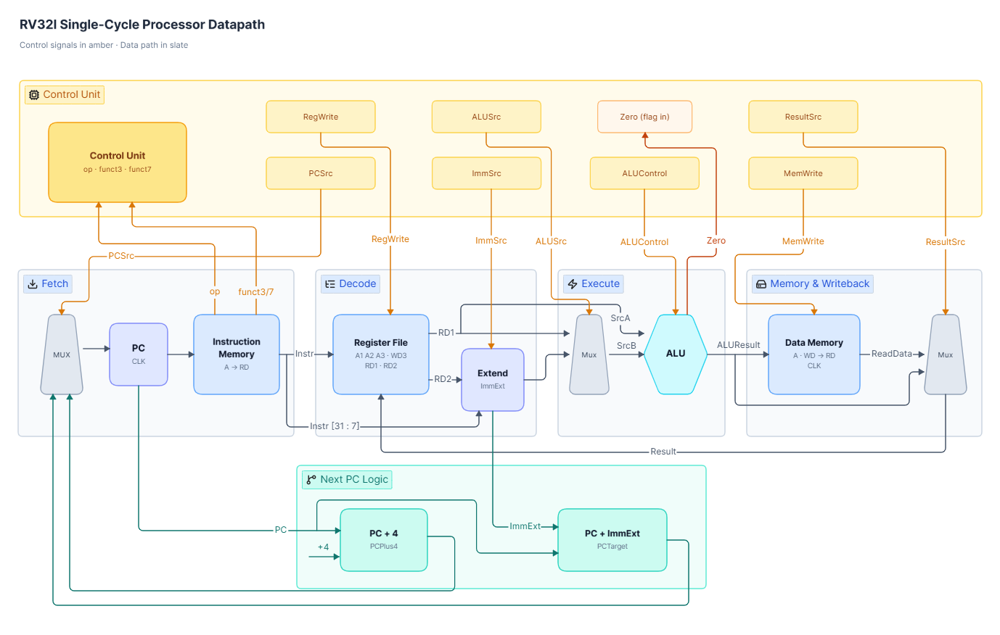

<!--
/**
 * Copyright 2026 Jordan Nzokou and Doeg Tiozang
 * Project: Nexvantis
 *
 * Licensed under the Apache License, Version 2.0 (the "License");
 * you may not use this file except in compliance with the License.
 * You may obtain a copy of the License at
 *
 *     https://www.apache.org/licenses/LICENSE-2.0
 *
 * Unless required by applicable law or agreed to in writing, software
 * distributed under the License is distributed on an "AS IS" BASIS,
 * WITHOUT WARRANTIES OR CONDITIONS OF ANY KIND, either express or implied.
 * See the License for the specific language governing permissions and
 * limitations under the License.
 */
-->

# Nexvantis - RV32I Single-Cycle Processor in Verilog


This repository is a modular 32-bit RISC-V single-cycle processor project built in
Verilog-2001 and verified through eleven independently executable milestones.
The repository is organized as a technical portfolio: a reviewer can inspect a
small block, run its self-checking testbench, follow its integration path, and
then reproduce the final architectural regression.

This release remains fully English across directory names, source comments,
testbenches, scripts, messages, diagrams, READMEs, technical documents, the
Excel ISA workbook, and the complete PDF report. Version 6 preserves the RTL
behavior and verification acceptance criteria while replacing every engineering
figure with a native Draw.io source and synchronized release exports.

<p align="center">
  
</p>

## Project at a glance

| Item | Implementation |
|---|---|
| Architecture | 32-bit single-cycle processor, Harvard instruction/data memories |
| ISA scope | RV32I subset: `ADD`, `SUB`, `AND`, `OR`, `SLT`, `ADDI`, `ANDI`, `ORI`, `SLTI`, `LW`, `SW`, `BEQ` |
| RTL language | Synthesizable Verilog-2001 for the processor blocks |
| Verification | Eleven directed, self-checking testbenches using four-state comparisons |
| Primary simulator | QuestaSim/ModelSim batch scripts |
| Open-source simulator | Icarus Verilog manifest-driven regression |
| Waveform debug | VCD export compatible with GTKWave |
| Software tooling | Two-pass mini-assembler and independent architectural reference model |
| Automation | Make, Bash, PowerShell, Python, GitHub Actions |
| Documentation | Per-milestone READMEs, engineering notes, 23 native Draw.io diagram families, Excel ISA workbook, complete English PDF report |

## Engineering objectives

The project is intentionally smaller than a production RISC-V core, but it is
engineered to demonstrate the reasoning expected in RTL design and verification:

- partition a processor into reviewable combinational and sequential blocks;
- define an explicit interface and timing contract for each block;
- derive control signals from instruction fields without hidden state;
- preserve architectural invariants such as `x0 == 0`;
- reconstruct split RISC-V immediates correctly;
- distinguish unsigned carry from signed overflow;
- integrate arithmetic, memory, and branch behavior incrementally;
- create tests that produce a machine-detectable verdict rather than relying
  only on visual waveform inspection;
- maintain deterministic scripts, program images, documentation, and diagrams;
- make assumptions and non-goals visible to a senior reviewer.

## Processor architecture

Nexvantis completes one instruction per clock period. There is no pipeline
register between fetch, decode, execute, memory, and write-back. The current
instruction therefore propagates through the complete combinational datapath,
and architectural state is committed on the next rising edge.

The architectural state elements are:

1. the 32-bit program counter;
2. the 32 x 32-bit register file;
3. the 256 x 32-bit data-memory array.

Instruction memory is a behavioral ROM initialized from `program.hex`. The
control unit is combinational and is partitioned into a main decoder and an ALU
decoder. The branch decision is qualified so that only a supported `BEQ` with an
equal comparison can redirect the PC.

### Instruction flow

1. **Fetch:** `PC` addresses instruction memory and `PC + 4` is computed.
2. **Decode:** opcode and function fields generate control signals; `rs1`, `rs2`,
   and `rd` address the register file; the selected immediate is reconstructed.
3. **Execute:** the ALU performs arithmetic/logic, calculates a memory address,
   or subtracts operands for `BEQ` equality testing.
4. **Memory:** `SW` writes synchronously; `LW` reads combinationally.
5. **Write-back:** either `ALUResult` or `ReadData` is written to `rd`.
6. **Next PC:** the processor selects `PC + 4` or `PC + ImmExt`.

See [Architecture](docs/ARCHITECTURE.md) for a signal-level walkthrough and
[Design decisions](docs/DESIGN_DECISIONS.md) for the rationale behind the
single-cycle model.

## Implemented instruction subset

| Class | Instructions | Datapath behavior |
|---|---|---|
| R-type ALU | `ADD`, `SUB`, `AND`, `OR`, `SLT` | Read two registers, execute in the ALU, write `rd` |
| I-type ALU | `ADDI`, `ANDI`, `ORI`, `SLTI` | Read `rs1`, sign-extend an immediate, write `rd` |
| Load | `LW` | Calculate `rs1 + imm`, read a 32-bit word, write `rd` |
| Store | `SW` | Calculate `rs1 + imm`, write the `rs2` word |
| Branch | `BEQ` | Subtract `rs1-rs2`; select `PC+imm` when equal |

The project does not claim full RV32I compliance. Unsupported opcodes and ALU
combinations resolve to deterministic benign controls rather than implementing
illegal-instruction traps.

## Design invariants

The implementation and tests protect the following contracts:

- `x0` always reads as zero and discards writes;
- `PC` updates only on a rising clock edge;
- `rst_n` is active-low and synchronous;
- word addresses presented externally are byte addresses;
- instruction and data memories use `A[9:2]` for 32-bit word indexing;
- the ALU is fully combinational and assigns every procedural output;
- signed `SLT` uses explicit signed operands;
- only `BEQ` with `funct3 == 3'b000` may assert `PCSrc`;
- an unsupported decode must not write registers or data memory;
- every testbench returns a clear PASS or fatal FAIL result.

## Repository map

| Path | Purpose |
|---|---|
| [`01_mux`](01_mux/README.md) | Parameterized combinational 2:1 multiplexer |
| [`02_pc_and_adders`](02_pc_and_adders/README.md) | Program-counter register and address adders |
| [`03_alu`](03_alu/README.md) | 32-bit ALU, signed comparison, and status flags |
| [`04_register_file`](04_register_file/README.md) | Dual-read, single-write RV32I register file |
| [`05_immediate_extension`](05_immediate_extension/README.md) | I-, S-, and B-type immediate reconstruction |
| [`06_memories`](06_memories/README.md) | Behavioral instruction ROM and data RAM |
| [`07_control_unit`](07_control_unit/README.md) | Main decoder, ALU decoder, and branch qualification |
| [`08_alu_register_integration`](08_alu_register_integration/README.md) | Arithmetic datapath integration |
| [`09_load_store_integration`](09_load_store_integration/README.md) | `LW`/`SW` transaction integration |
| [`10_branch_integration`](10_branch_integration/README.md) | `BEQ` and next-PC integration |
| [`11_final_processor`](11_final_processor/README.md) | Complete core and architectural regression |
| [`12_tools`](12_tools/README.md) | Mini-assembler and reproducible program image |
| [`scripts`](#scripts-and-automation) | Repository checks, simulation runner, reference model, diagram/report support |
| [`docs`](docs/PORTFOLIO_OVERVIEW.md) | Architecture, verification, decisions, results, review guide, roadmap |

Integration milestones intentionally contain local copies of the canonical RTL
modules. This allows each milestone to compile in isolation. The repository
checker compares repeated modules and rejects accidental divergence.

## Milestone progression

<p align="center">
  
</p>

The first seven milestones verify individual blocks. Milestones 8-11 then add
one architectural capability at a time. This progression localizes failures:
for example, a failure introduced in milestone 10 is likely related to the
branch target, equality decision, or next-PC selection rather than the already
validated arithmetic and memory paths.

## Quick start

### Prerequisites

Use one of the following simulator paths:

- **QuestaSim or ModelSim** for the supplied `.do` scripts;
- **Icarus Verilog** (`iverilog` and `vvp`) for the open-source regression.

Optional tools:

- **GTKWave** to inspect generated VCD files;
- **Draw.io Desktop/diagrams.net** to edit the native `.drawio` sources;
- **Inkscape**, **Pillow**, and **PyMuPDF** to rebuild and annotate diagram exports;
- **XeLaTeX** to rebuild the report;
- **Python 3.10+** for repository tools and the reference model;
- **GNU Make** for the consolidated command interface.

### Clone and inspect

```bash
git clone <repository-url>
cd nexvantis-rv32i-single-cycle
make help
make preflight
```

`make preflight` does not require an RTL simulator. It validates repository
structure, notices, links, repeated RTL, Python unit tests, assembly/HEX
reproducibility, and the independent architectural model.

### Run the complete Icarus Verilog regression

```bash
make test
```

Retain VCD files for waveform review:

```bash
make test-vcd
```

Run a single milestone:

```bash
make test-project PROJECT=03_alu
```

### Run QuestaSim/ModelSim

One milestone:

```bash
cd 11_final_processor
vsim -c -do run_questa.do
```

All milestones on Linux/macOS:

```bash
bash run_all_linux.sh
```

All milestones in Windows PowerShell:

```powershell
./run_all_windows.ps1
```

Each testbench emits `TEST ... PASSED` or terminates with `$fatal`.

## Scripts and automation

The script layer is part of the engineering deliverable, not an incidental
helper. It makes the repository reproducible for reviewers and CI. Version 6
documents every public script and its relationship to the RTL, Draw.io assets,
ISA workbook, and report.

<p align="center">
  
</p>

### Makefile entry points

| Command | What it runs | Simulator required |
|---|---|---|
| `make help` | Lists supported public targets | No |
| `make repository-check` | Structure, English paths, notices, links, repeated RTL, generated-artifact checks | No |
| `make python-test` | Mini-assembler unit tests | No |
| `make reference-test` | Reference-model unit tests | No |
| `make assemble` | Regenerates `final_program_generated.hex` from assembly | No |
| `make assemble-check` | Proves final `program.hex` is reproducible | No |
| `make reference-model` | Executes the final program in the independent model | No |
| `make preflight` | Runs all non-RTL validation above | No |
| `make iverilog` | Runs all eleven RTL simulations from the JSON manifest | Icarus |
| `make test` | Runs preflight and the complete Icarus regression | Icarus |
| `make test-vcd` | Same regression with retained VCD waveforms | Icarus |
| `make test-project PROJECT=<dir>` | Runs one milestone and retains its VCD | Icarus |
| `make questa` | Executes the root Linux Questa batch script | Questa/ModelSim |
| `make diagrams` | Rebuilds 23 native Draw.io sources, the combined Draw.io library, and synchronized SVG/PNG/PDF exports | Python + Inkscape |
| `make report` | Regenerates diagrams and compiles the English report | XeLaTeX |
| `make checksums` | Rebuilds the release SHA-256 inventory after all artifacts are final | No |
| `make clean` | Removes simulator and LaTeX build artifacts | No |

### Root scripts

| Script | Responsibility |
|---|---|
| [`run_all_linux.sh`](run_all_linux.sh) | Iterates over the eleven milestones and invokes each `run_questa.do` in batch mode on Linux/macOS |
| [`run_all_windows.ps1`](run_all_windows.ps1) | PowerShell equivalent of the complete Questa/ModelSim regression |
| [`scripts/run_iverilog.py`](scripts/run_iverilog.py) | Reads `project_manifest.json`, compiles the listed sources, executes `vvp`, checks exit status, and optionally preserves VCD files |
| [`scripts/repository_check.py`](scripts/repository_check.py) | Enforces repository structure, required README sections, local link integrity, English paths, project notices, clean generated state, and repeated-RTL consistency |
| [`scripts/reference_model.py`](scripts/reference_model.py) | Executes the supported instruction subset independently of the Verilog implementation and reports architectural evidence |
| [`scripts/test_reference_model.py`](scripts/test_reference_model.py) | Unit tests the decoder/execution behavior and final state of the reference model |
| [`scripts/generate_diagrams.py`](scripts/generate_diagrams.py) | Builds professional native Draw.io documents from one geometry model, creates the combined library, and emits synchronized SVG/PNG/PDF outputs with project metadata |
| [`scripts/build_report.sh`](scripts/build_report.sh) | Compiles the complete English XeLaTeX report and copies the release PDF to `00_documentation` |
| [`scripts/generate_checksums.py`](scripts/generate_checksums.py) | Regenerates the repository SHA-256 inventory for release verification |

### Per-milestone scripts

Every directory from `01_mux` through `11_final_processor` includes:

- `run_questa.do`: creates a clean work library, compiles local source files,
  starts the testbench in command-line mode, writes a VCD, and exits with a
  simulator status suitable for automation;
- `run_iverilog.sh`: a small local wrapper that compiles the milestone with
  warnings enabled, defines `DUMP_VCD`, executes the result, and cleans the
  temporary build directory on success.

The manifest [`project_manifest.json`](project_manifest.json) is the single
machine-readable source for milestone order, source lists, top-level testbench,
VCD name, and display title. This avoids duplicating source-order logic inside
the Python runner.

### Program-generation scripts

[`12_tools/mini_assembler.py`](12_tools/mini_assembler.py) is a deliberately
small two-pass assembler for the implemented instruction subset. Pass 1 records
labels and byte addresses. Pass 2 encodes each instruction and resolves
PC-relative branch offsets. Its output is compared byte-for-byte with the final
processor ROM image.

## Verification strategy

The testbenches are directed and self-checking. Each one contains:

1. deterministic initialization;
2. reusable check tasks;
3. four-state comparisons using `!==` so `X` and `Z` cannot pass silently;
4. a mismatch counter that allows all planned checks to complete;
5. optional VCD dumping under `DUMP_VCD`;
6. a single CI-friendly final verdict.

Unit-level tests cover truth tables, reset semantics, arithmetic boundaries,
signed comparisons, memory indexing, decode combinations, unsupported inputs,
and architectural invariants. Integration tests add transaction counts, skipped
PC detection, taken-branch evidence, memory side effects, and terminal-loop
stability.

Read [Verification strategy](docs/VERIFICATION_STRATEGY.md) and the
[Testbench guide](00_documentation/TESTBENCH_GUIDE.md) for the complete method.

## Final regression evidence

The final testbench checks:

- eleven architectural register values;
- two data-memory words;
- exactly two `MemWrite` pulses;
- non-execution of the instruction at `PC = 0x24`;
- at least two taken-branch events, including the terminal loop;
- final stabilization at `PC = 0x3C`;
- deterministic ROM-image regeneration from assembly.

Expected architectural state:

```text
x5  = 00000005    x6  = 00000004    x7  = 00000005
x8  = 00000004    x9  = 00000001    x10 = 00000001
x11 = 00000005    x12 = 00000002    x13 = FFFFFFFF
x14 = 00000001    x15 = FFFFFFFF

mem[0] = 00000005
mem[1] = 00000002
final PC = 0000003C
stores = 2
```

See [Expected results](docs/RESULTS.md) and
[Final processor](11_final_processor/README.md).

## Code-commenting standard

Comments are written for engineering review rather than tutorial narration. They
explain information that is not obvious from syntax alone:

- timing and reset semantics;
- interface contracts and invariants;
- why a specific expression implements an ISA rule;
- signed/unsigned interpretation;
- memory address mapping;
- control qualification and safe defaults;
- what a test proves and why a corner case matters;
- automation assumptions and failure behavior.

Comments do not replace clear RTL. They document intent, boundaries, and risks
while preserving the executable behavior of the previous release.

## Senior-review path

A focused review can proceed in this order:

1. read this README and [Portfolio overview](docs/PORTFOLIO_OVERVIEW.md);
2. inspect [Architecture](docs/ARCHITECTURE.md) and the top-level diagram;
3. run `make preflight`;
4. review milestones 3, 7, 10, and 11 for datapath/control complexity;
5. run `make test` or the Questa scripts;
6. compare waveform evidence with [Expected results](docs/RESULTS.md);
7. use [Senior review guide](docs/REVIEW_GUIDE.md) for targeted questions.

## Scope boundary

This is a single-cycle educational/portfolio core, not a production CPU. It does
not implement:

- full RV32I instruction coverage;
- `JAL`, `JALR`, `LUI`, or `AUIPC`;
- shifts, byte/halfword loads and stores, multiply/divide;
- exceptions, interrupts, CSRs, or privileged modes;
- misaligned-access handling;
- instruction/data buses, caches, or memory protection;
- a pipeline, forwarding, hazard detection, or branch prediction;
- formal proofs, CDC analysis, DFT, physical timing closure, or FPGA constraints.

These limits are explicit so the implemented claims remain auditable.

## Documentation index

- [Portfolio overview](docs/PORTFOLIO_OVERVIEW.md)
- [Architecture](docs/ARCHITECTURE.md)
- [Verification strategy](docs/VERIFICATION_STRATEGY.md)
- [Design decisions](docs/DESIGN_DECISIONS.md)
- [Senior review guide](docs/REVIEW_GUIDE.md)
- [Expected results](docs/RESULTS.md)
- [Roadmap](docs/ROADMAP.md)
- [GitHub publishing checklist](docs/GITHUB_PUBLISHING.md)
- [Report alignment](docs/MANUAL_ALIGNMENT.md)
- [Validation status](VALIDATION.md)
- [ISA workbook](00_documentation/Nexvantis_RV32I_Instruction_Set_Architecture_V6.xlsx)
- [Repository contents](00_documentation/REPOSITORY_CONTENTS.md)
- [Testbench guide](00_documentation/TESTBENCH_GUIDE.md)
- [Changelog](CHANGELOG.md)
- [Contributing](CONTRIBUTING.md)
- [Security](SECURITY.md)

## Copyright and license

Copyright 2026 Jordan Nzokou and Doeg Tiozang. Project: Nexvantis.

Licensed under the Apache License, Version 2.0. See [LICENSE](LICENSE) and
[NOTICE](NOTICE).
